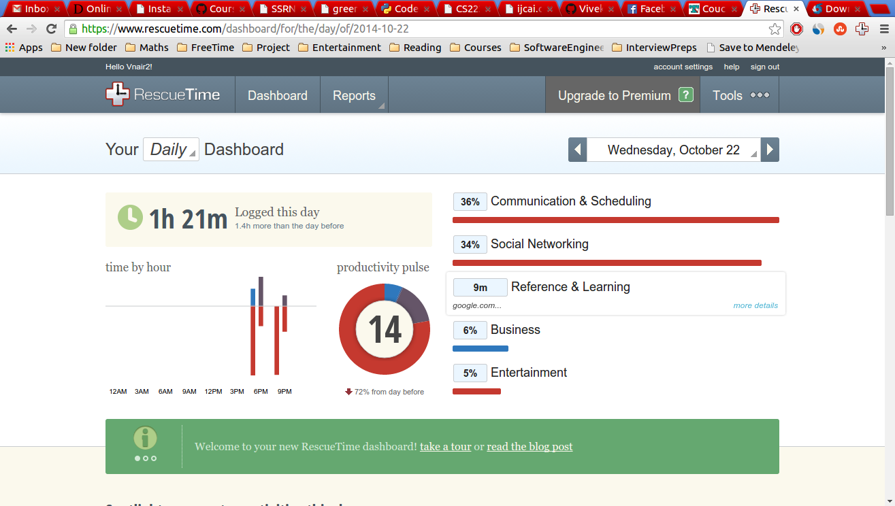
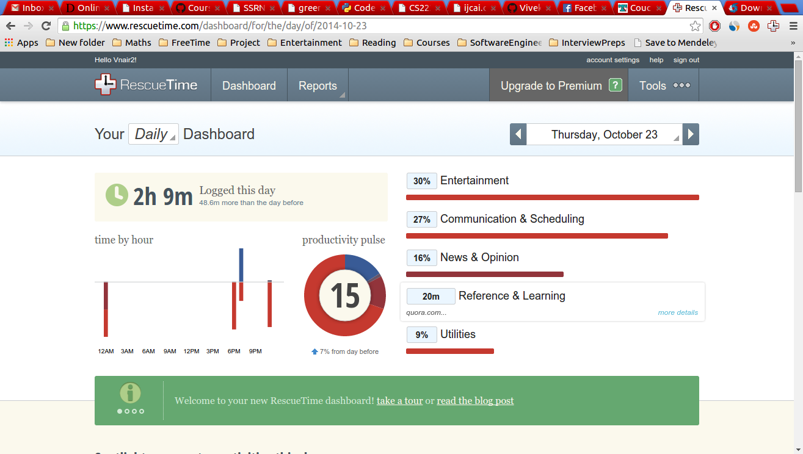
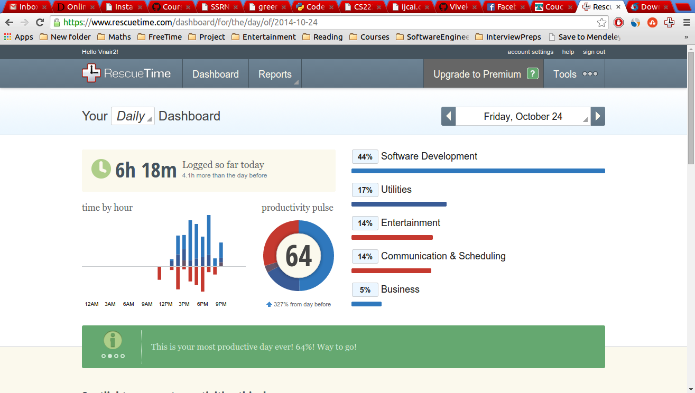

Productivity Report
======
Productivity report for Vivek Nair.

1. Installation
------------
I installed RescueTime on Wednesday(Aug 22). This involved installing a browser plugin and a .deb file.

2. Report
------
**Wednesday:** 
I was at my lab the whole day and working on the lab machine. This is clearly seen in the report where I am just active for a period of 2 hours. The screenshot is as seen below. 

The most of the time I am answering emails at the end of the day and checking facebook etc.

**Thursday:**
Again I was at the lab today and had a couple of classes to attend. We can observe the same trend as the wednesday since I was at the class most of the time and not carry about my laptop.

**Friday**
I was at home today and most of the time I was working on my assignment which is evident from the fact that I have been using vim and visiting stackoverflow for most of the time.

3. Conclusion
-------------

Find below the things that I would like to change in my daily schedule to increase my productivity
1. Put in more time in development. This is not the correct way to judge this since I have not been using this laptop for most part of the day. But again it's is always nice to put in more time into work.
2. Spend less time on social networking sites. I am thinking of adding some plugins which would stop me from visiting facebook and other social networking sites during work hours.
3. I would like to refrain myself from checking emails and answering them during work hours. I have noticed that this is very distracting. I would also turn off the notification of my cell phone. 
